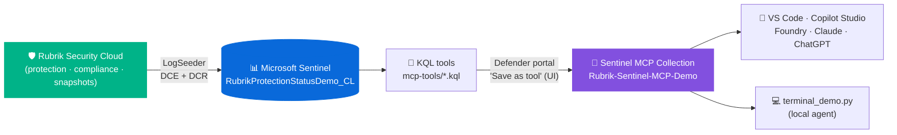

# Rubrik Sentinel MCP Demo (UI publish variant)

> **Variant:** This repo publishes the custom MCP tools through the **Microsoft Defender portal UI** ("Save as tool" flow), with no API publishing script. For the API-driven variant, see [`rubrik-sentinel-mcp-demo`](https://github.com/MitchellGulledge3/rubrik-sentinel-mcp-demo).

This repo is a GitHub-ready reference implementation for a Rubrik developer who wants to show an end-to-end Microsoft Sentinel custom MCP tool integration.

The purpose is not to ship another generic chatbot. The purpose is to show how an ISV can expose focused, high-value cyber-resilience and backup-posture capabilities as **MCP tools** over the data they already bring into Microsoft Sentinel via the [Rubrik Security Cloud Sentinel solution](https://securitystore.microsoft.com/solutions/rubrik_inc.rubrik_sentinel). Once those tools exist, a terminal demo, the Rubrik product experience, a Copilot-style UI, or another agent runtime can call the same capability.

## The story in one sentence

Rubrik already streams rich backup-posture signals into Sentinel via the Security Store solution; MCP turns that telemetry into reusable agent tools such as "summarize backup posture," "find out-of-compliance assets," "hunt unprotected workloads," "triage snapshot failures," and "identify storage capacity risk."

## Architecture at a glance



## New to Sentinel? Read this first

| Term | Plain-English meaning |
| --- | --- |
| Microsoft Sentinel | Microsoft's cloud SIEM. Collect logs, detect threats, investigate, respond. |
| Log Analytics workspace | The Azure data store Sentinel uses for logs. |
| Table | A named set of rows in the workspace. This demo writes to `RubrikProtectionStatusDemo_CL`. |
| KQL | Kusto Query Language. Used to query Sentinel logs. |
| LogSeeder | A sample-data tool that creates a table and inserts realistic demo rows. |
| DCE | Data Collection Endpoint. The Azure ingestion URL where custom log data is sent. |
| DCR | Data Collection Rule. Maps incoming JSON into the right table and columns. |
| MCP tool | A callable tool an agent can use. In this repo, each MCP tool runs one curated KQL query. |
| SLA Domain | A Rubrik policy that defines snapshot frequency, retention, archival and replication targets. |

The short version: **LogSeeder puts Rubrik-shaped protection rows into Sentinel; KQL asks useful cyber-resilience questions; MCP wraps those questions so an agent or app can call them.**

## What this demo proves

A Rubrik developer can:

1. Start from the official Rubrik Security Cloud Sentinel connector table schema.
2. Use Sentinel LogSeeder to create a demo custom table and seed realistic protection telemetry.
3. Publish high-value KQL questions as Sentinel custom MCP tools — **via the Defender portal UI**.
4. Call those tools from a simple terminal prompt loop or any future agent runtime.

## What gets created

| Asset | Created by | Why it exists |
| --- | --- | --- |
| `RubrikProtectionStatusDemo_CL` table | LogSeeder | Stores demo Rubrik protection-status telemetry in Sentinel |
| Data Collection Endpoint | LogSeeder/Azure Monitor | Provides the ingestion endpoint for custom logs |
| Data Collection Rule | LogSeeder/Azure Monitor | Maps JSON fields into the custom table columns |
| `Rubrik-Sentinel-MCP-Demo` collection | Defender portal "Save as tool" UI | Groups the custom MCP tools |
| Five MCP tools | Defender portal "Save as tool" UI | Expose repeatable Rubrik investigation questions |
| Terminal demo | `terminal_demo.py` | Lets a presenter call the tools from a prompt |

## Demo table

The demo table is `RubrikProtectionStatusDemo_CL`. It uses the same column names and types as the official Rubrik Security Cloud Sentinel solution table from:

```text
https://raw.githubusercontent.com/Azure/Azure-Sentinel/master/Solutions/RubrikSecurityCloud/Data%20Connectors/RubrikSecurityCloud_CCF/RubrikSecurityCloud_Table.json
```

## End-to-end use case

**Use case:** a backup admin, security lead, or CISO asks Rubrik "are my workloads protected, which ones miss SLA, which fail snapshot/replication/archival, and where is storage growing fastest?"

The MCP tools expose that investigation as reusable capabilities:

| Tool | Purpose |
| --- | --- |
| `Rubrik_Backup_Posture_Summary` | Executive backup posture: protection coverage, compliance state, snapshot/storage health |
| `Rubrik_Out_Of_Compliance_Assets` | SLA violations broken down by cluster, SLA domain, and object type |
| `Rubrik_Unprotected_Asset_Hunt` | Objects that are Unprotected, AwaitingFirstFull, or have zero snapshots |
| `Rubrik_Snapshot_Failure_Triage` | Assets and clusters with missed snapshots; archival/replication lag drill-down |
| `Rubrik_Storage_Capacity_Risk` | Per-cluster local/archive/replica storage and data-reduction outliers |

## Prerequisites

1. **Azure CLI** authenticated to the Sentinel workspace subscription (for LogSeeder).
2. **A Log Analytics workspace** with Microsoft Sentinel enabled.
3. **Microsoft Sentinel data lake enabled** and a **Microsoft Defender** license (for the Save-as-tool flow).
4. **PowerShell 7** for LogSeeder.
5. **Python 3.9+** for the terminal demo.
6. **Defender portal role**: Security Operator, Security Admin, or Global Admin to create custom MCP tools.

For the existing demo workspace, the configured workspace customer ID is:

```text
77429a58-865a-4764-8429-aaacdfe3cb73
```

## Seed data with LogSeeder

```bash
cp /path/to/rubrik-sentinel-mcp-demo-ui/logseeder/RubrikProtectionStatusDemo_CL.json ./schemas/
cd /path/to/sentinel-logseeder
pwsh -NoLogo -NoProfile -ExecutionPolicy Bypass \
  -File ./scripts/Invoke-SampleDataIngestion.ps1 \
  -TableName RubrikProtectionStatusDemo_CL \
  -Schema ./schemas/RubrikProtectionStatusDemo_CL.json \
  -RowCount 500 \
  -TimeWindowMinutes 1440 \
  -Deploy -Ingest
```

Verify rows:

```kql
RubrikProtectionStatusDemo_CL
| summarize RowCount=count(), FirstSeen=min(TimeGenerated), LastSeen=max(TimeGenerated)
```

If the query returns zero rows immediately after ingestion, wait a few minutes. New custom tables and DCR mappings can take time to become queryable.

Useful validation queries:

```kql
RubrikProtectionStatusDemo_CL
| summarize Assets=count(),
            Clusters=make_set(ClusterName, 10),
            Slas=make_set(SlaDomainName, 15),
            ObjectTypes=make_set(ObjectType, 15)
```

```kql
RubrikProtectionStatusDemo_CL
| where ComplianceStatus == "OutOfCompliance"
| summarize OOC=count() by ClusterName, SlaDomainName
```

## Publish custom MCP tools (UI flow)

This variant of the demo does **not** include an API publisher script. Instead, you save each KQL query as a custom MCP tool by hand in the Microsoft Defender portal's Advanced Hunting page using the **Save as tool** flow.

Suggested collection name:

```text
Rubrik-Sentinel-MCP-Demo
```

Full step-by-step walkthrough (with field-by-field guidance and the official Microsoft Learn links):

➡️ [`docs/publish-tools-via-ui.md`](docs/publish-tools-via-ui.md)

Short version:

1. Open https://security.microsoft.com → **Hunting** → **Advanced hunting**.
2. Paste a KQL file from `mcp-tools/`, run it once to confirm rows.
3. Click **Save as tool** (context menu or KQL box menu).
4. In the flyout, set **Name** = the `.kql` filename without extension, paste the matching **Description**, choose or create the `Rubrik-Sentinel-MCP-Demo` **Collection**, set the **Default workspace** to your Sentinel workspace.
5. Repeat for every `.kql` file in `mcp-tools/`.

Reference: [Create and use custom Microsoft Sentinel MCP tools (preview)](https://learn.microsoft.com/azure/sentinel/datalake/sentinel-mcp-create-custom-tool)

## Terminal demo

```bash
cd /path/to/rubrik-sentinel-mcp-demo-ui
python3 -m venv .venv
source .venv/bin/activate
pip install -r requirements.txt
cp .env.example .env
```

Edit `.env`:

```text
MCP_DEFAULT_ARGUMENTS={"workspaceId":"<log-analytics-workspace-customer-id>"}
```

Run:

```bash
python3 terminal_demo.py --show-raw
```

Type prompts like:

```text
Summarize Rubrik backup posture
Show out-of-compliance Rubrik assets
Hunt unprotected Rubrik objects
Triage Rubrik snapshot failures
Show Rubrik storage capacity risk
```

Single-shot:

```bash
python3 terminal_demo.py --prompt "Triage Rubrik snapshot failures" --show-raw
```

The terminal demo has a simple prompt router:

| Prompt contains | Tool selected |
| --- | --- |
| `compliance`, `sla`, `archival`, `replication`, `out of compliance` | `Rubrik_Out_Of_Compliance_Assets` |
| `unprotected`, `awaiting`, `no snapshot`, `no backup`, `first full` | `Rubrik_Unprotected_Asset_Hunt` |
| `failure`, `missed`, `failed snapshot`, `triage`, `skipped` | `Rubrik_Snapshot_Failure_Triage` |
| `storage`, `capacity`, `data reduction`, `growth`, `usage` | `Rubrik_Storage_Capacity_Risk` |
| anything else | `Rubrik_Backup_Posture_Summary` |

## Talk track

> Rubrik already lands a fantastic stream of backup-posture and cyber-resilience telemetry in Sentinel via the Security Store solution. Custom MCP tools turn that telemetry into reusable, agent-callable capabilities — and with the Defender portal "Save as tool" flow, you don't even need code to publish them.

## How to adapt this for production

| Demo piece | Production direction |
| --- | --- |
| `RubrikProtectionStatusDemo_CL` | Use the real `RubrikProtectionStatus_CL` table from the Sentinel solution |
| LogSeeder sample values | Real Rubrik Security Cloud telemetry via the official CCP connector |
| Static prompt router | Explicit product UI actions or an agent planner |
| Terminal demo | Embed the same tool calls into Rubrik console, Copilot-like app, or partner integration |
| Single workspace ID | Customer configuration chooses the Sentinel workspace |

## Files

| Path | Purpose |
| --- | --- |
| `logseeder/RubrikProtectionStatusDemo_CL.json` | LogSeeder schema derived from the official Rubrik Security Cloud Sentinel schema |
| `logseeder/source-schema-url.txt` | URL to the official Rubrik Sentinel connector schema source file |
| `mcp-tools/*.kql` | KQL definitions for custom Sentinel MCP tools |
| `docs/publish-tools-via-ui.md` | Step-by-step UI walkthrough for saving the KQL files as Sentinel custom MCP tools |
| `terminal_demo.py` | Interactive terminal prompt loop that routes prompts to the Rubrik MCP tools |
| `sentinel_mcp_demo/` | Minimal Sentinel MCP client used by the terminal demo |
| `docs/tool-use-cases.md` | Use-case, value-add, and story guide for every MCP tool |
| `docs/sample-tool-runs.md` | Captured sample output from running each MCP tool |
| `docs/call-runbook.md` | Step-by-step runbook for the Rubrik demo call |
